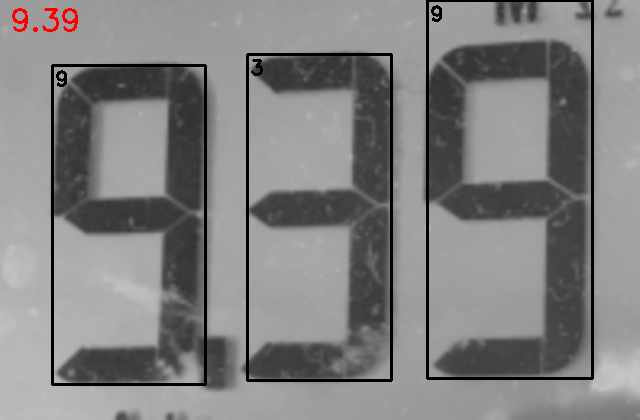

# Seven-Segment-Recognition
此專案的目的是辨識面板上的數字，因此參考了下面連結中的做法，並從中修改了些地方來實現專案的需求。  
https://github.com/jiweibo/SSOCR

## 辨識流程與結果
為了降低辨識數字演算法的出錯率，我先使用YOLOv5找出數字的區域，如下圖  

將數字區域剪裁之後，執行辨識演算法得到結果，如下圖  

## 後續實驗
目前的做法只針對"面板"的數字做辨識，當遇到七段顯示器的數字(如下圖)需要用其他方法先過濾出數字的部分才能進行辨識。  

